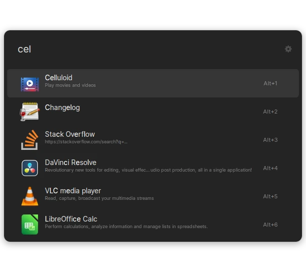

<h1 align="center">
  <code>ulauncher-theme-libadwaita-dark</code>
</h1>

> **Note**  
> This theme is fork from <a href="https://github.com/leodr/ulauncher-theme-libadwaita">leodr/ulauncher-theme-libadwaita</a>.  
> Thanks for a great theme.

<p align="center">
    <strong>A Ulauncher theme that looks native under <code>libadwaita</code>.</strong>
</p>

<p align="center"> 
    <a href="https://github.com/leodr/ulauncher-theme-libadwaita/blob/main/LICENSE">
        
    </a>
    <a href="https://twitter.com/leodriesch">
        
    </a>
</p>

<p align="center">
    <a href="#-screenshots"><b>Screenshots</b></a>
    <span>  •  </span>
    <a href="#-installation"><b>Installation</b></a>
    <span>  •  </span>
    <a href="#-issues"><b>Issues</b></a>
    <span>  •  </span>
    <a href="#-contribute"><b>Contribute</b></a>  
</p>

---

A theme for [Ulauncher](https://ulauncher.io/) that's supposed to look native
under `libadwaita` and GTK4.

The colors and metrics were obtained by using the
[GtkInspector](https://wiki.gnome.org/Projects/GTK/Inspector) tool on the GNOME
Settings application on GNOME 43.

<br>

## ❯ Screenshots

<div align="center"></div>

<br>

## ❯ Installation

Run the following script in your terminal:

```bash
mkdir -p ~/.config/ulauncher/user-themes

git clone https://github.com/irhdevel/ulauncher-theme-libadwaita-dark.git \
  ~/.config/ulauncher/user-themes/libadwaita-dark
```

<br>

## ❯ Issues

The box-shadow is not correct. The ideal value would be

```css
box-shadow: 0 2px 8px 2px rgba(0, 0, 0, 0.13), 0 3px 20px 10px rgba(0, 0, 0, 0.09),
  0 6px 32px 16px rgba(0, 0, 0, 0.04), 0 0 0 1px rgba(0, 0, 0, 0.05);
```

which is the box-shadow used by active GTK4 windows, however, Ulauncher cuts off
shadows that go 20px beyond the window. So the current shadow is an alternative
look that does not get cut off.

<br>

## ❯ Contribute

If you think you have any ideas that could benefit the project, feel free to
create a pull request!

<br>

---

<p align="center">
    <sub>
        Project by Leo Driesch, released under <a href="https://github.com/leodr/ulauncher-theme-libadwaita/blob/main/LICENSE">GPL 3.0 License</a>.
    </sub>
</p>
